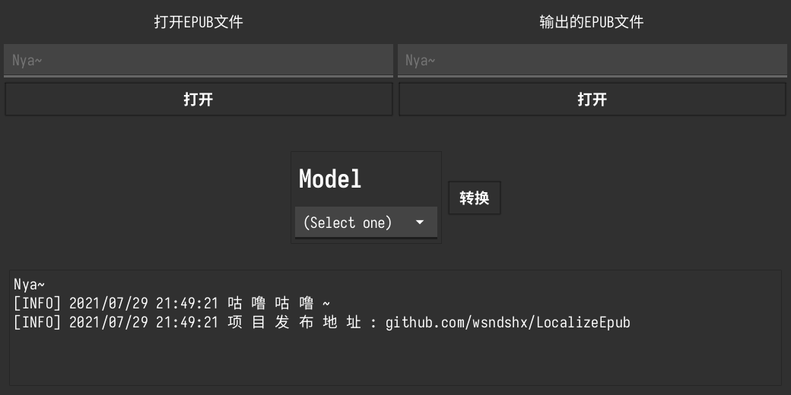

# LocalizeEpub

> 如果你只需要在Windows平台下使用, 这里有个看起来会更好一些的: [LocalizeEpub_For_Windows](https://github.com/wsndshx/LocalizeEpub_For_Windows)

使用繁化姬(Fanhuaji)对EPUB文件进行繁化/简化操作



## 安装

### 成品

前往该项目的[发布页](https://github.com/wsndshx/LocalizeEpub/releases)下载最新的构建版本

### 构建

```shell
git clone https://github.com/wsndshx/LocalizeEpub.git
cd LocalizeEpub
make
```

## 使用说明

在程序界面的左边选择你需要转换的epub文件，右边设置转换后的文件输出路径和名称。选择好后在`Model`中选择你想使用的转换模式，并且按下`转换`即可。

界面的最下方为一个辣鸡的假终端，用于输出日志（虽然没啥用）。

## 转换模式

- 简体化：将文字转换为简体。
- 繁體化：將文字轉換為繁體。
- 中国化：将文字转换为简体，并使用中国地区的词语修正。
- 香港化：將文字轉換為繁體，並使用香港地區的詞語修正。
- 台灣化：將文字轉換為繁體，並使用台灣地區的詞語修正。
- 维基简体化：只使用维基百科的词库将文字转换为简体。
- 維基繁體化：只使用維基百科的詞庫將文字轉換為繁體。

## 翻译错误

由于本软件使用了繁化姬的提供的 API 进行翻译，软件本身并不进行转换工作。若您发现有翻译错误的部分，可以在下面的这些地方进行反馈。

- [繁化姬](https://zhconvert.org/)
- [繁化姬 GitHub 讨论页](https://github.com/Fanhuaji/discussion/issues)
- [繁化姬 Telegram 群組](https://t.me/fanhuaji)

## 感谢

本项目使用了以下项目：

- [繁化姬](https://zhconvert.org/)
- [psanford/memfs: In-memory implementation of Go's `io/fs.FS` interface](https://github.com/psanford/memfs)
- [be5invis/Sarasa-Gothic: Sarasa Gothic / 更纱黑体 / 更紗黑體 / 更紗ゴシック / 사라사 고딕](https://github.com/be5invis/Sarasa-Gothic)
- [fyne-io/fyne: Cross platform GUI in Go inspired by Material Design](https://github.com/fyne-io/fyne)